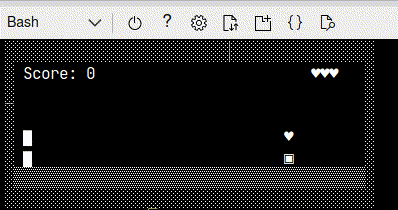

# CROUCH AND JUMP

Following code is a simple game that where the player can jump and crouch to avoid obstacles and collect hearts to regain lives.

## Installation

To install the game, you need to have Go installed on your machine. You can download it from [here](https://golang.org/dl/).

After installing Go, you can run the following commands to install the game and run it. Below example is for Linux, but you can run similar commands on Windows and MacOS:

```bash
export GOPATH="$HOME/go"
PATH="$GOPATH/bin:$PATH"
go install github.com/groovy-sky/crouch-and-jump@latest
crouch-and-jump
```

## How to play

- Press Up or Down arrow keys to jump or crouch.
- Collect hearts to regain lives.
- Avoid obstacles.
- Press escape to exit the game.

## Gameplay



## License

[LICENSE](LICENSE.md)